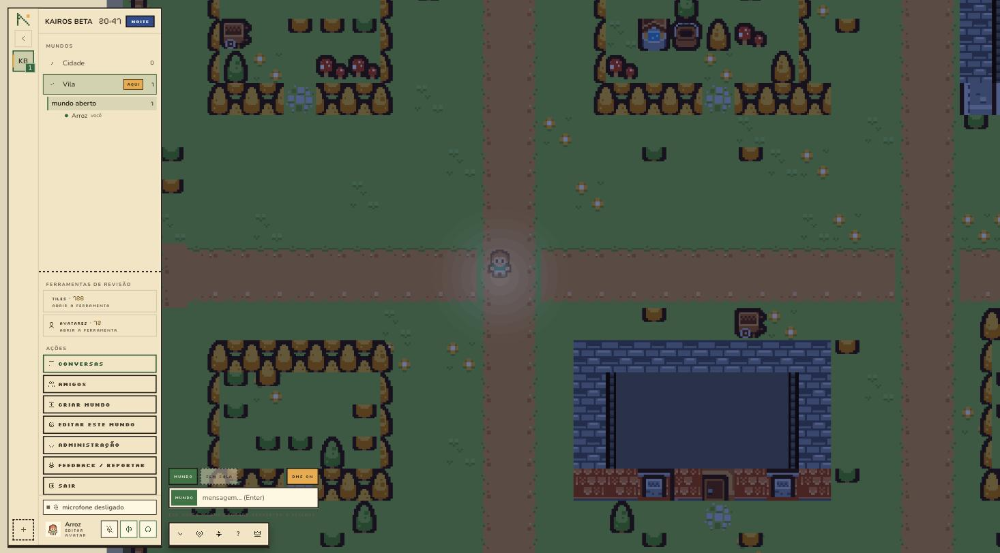

# icaromelodev.com.br

Meu portfólio. Vue 3 + Quasar, SPA estático, deploy automático no push para a `main`.



## Por que foi refeito

A versão anterior listava tecnologias e não mostrava trabalho: oito projetos descritos,
nenhum mostrado, e nenhuma linha sobre os lugares onde eu de fato trabalhei. Ela também
usava quase o vocabulário visual inteiro que hoje identifica uma página gerada por modelo —
fundo quase preto com acento verde ácido, grade de pontos, rótulos de seção escritos como
comentário de código.

A reescrita partiu do conteúdo, não do layout.

## A decisão que organizou o resto

Os projetos saem de `src/data/projetos.ts`, e cada um carrega um **estado** declarado na
frente do card: estável, em desenvolvimento, finalizado ou pausado. Isso força a informação
a permanecer honesta — um projeto pausado aparece como pausado, e é justamente isso que dá
crédito aos que estão de pé.

O link do repositório sai da mesma estrutura, atrás de uma flag `repoPublico`. Enquanto o
repositório é privado, o link simplesmente não é renderizado, em vez de apontar para um 404.

## Rodando localmente

```
npm install
npx quasar dev
```

## Stack

Vue 3 · Quasar · Vite · TypeScript
